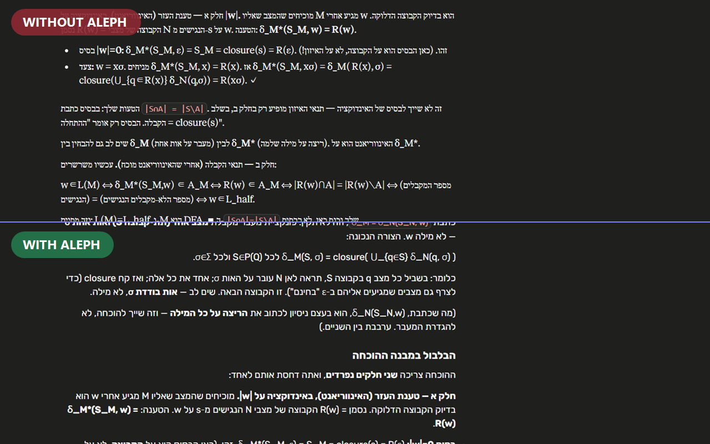

# Aleph (א) — AI Chat Styler

A Chrome extension that fixes Hebrew, Arabic-script, English, and math bidirectional text rendering and gives you consistent styling controls across **Claude**, **ChatGPT**, and **Gemini**.




**[Install from the Chrome Web Store](https://chromewebstore.google.com/detail/jpicfbmjogpihahcmephbnibnjkfkfia)**

## The problem

AI chat platforms render RTL text poorly. When Hebrew, Arabic, Persian, or Urdu mixes with English words or math expressions, the bidirectional text algorithm breaks — words appear in the wrong order, math equations flip, and lists point the wrong way. Each platform (Claude, ChatGPT, Gemini) has different DOM structures, making a universal fix non-trivial.

On top of that, each platform uses different fonts, sizes, and spacing — making it jarring to switch between them.

## What Aleph does

**BiDi fixing** — Automatically detects Hebrew and Arabic-script content in AI responses and input boxes, applies correct RTL direction while keeping math (KaTeX, MathJax) and code blocks in LTR. Works in real-time as responses stream in.

**Style unification** — A popup settings panel lets you override typography, code block appearance, and layout width across all three platforms:

- **Font family** — Choose an RTL-friendly font (Rubik, Heebo, Assistant, Noto Sans Hebrew, Noto Sans Arabic, Cairo, Vazirmatn, Noto Nastaliq Urdu, etc.) that applies everywhere
- **Font size & line height** — Adjust readability to your preference
- **Paragraph spacing** — Control density of response text
- **Code block font & size** — Pick your preferred monospace font
- **Chat width** — Widen the narrow default conversation column
- **Usage insights** — Track local time, sends, token estimates, plan spend, and provider quota snapshots

Settings sync through Chrome storage by default. Optional Google sign-in backs up settings and usage insights to your own Firebase-backed cloud account so they can follow you across devices — each device syncs its own daily summaries so multi-device totals add up, and cloud data expires after 400 days (see `docs/SYNC.md`). Conversation text is never read or synced.

## Installation

1. Clone or download this repository
2. Open `chrome://extensions` in Chrome
3. Enable **Developer mode** (top-right toggle)
4. Click **Load unpacked**
5. Select the `aleph` folder

The א icon will appear in your extensions bar. Click it to open settings.

## Supported platforms

| Platform | URL | BiDi fix | Style overrides | Usage insights |
|----------|-----|----------|-----------------|----------------|
| Claude | `claude.ai` | ✓ | ✓ | ✓ |
| ChatGPT | `chatgpt.com` | ✓ | ✓ | ✓ |
| Gemini | `gemini.google.com` | ✓ | ✓ | ✓ |

## How it works

The extension injects a content script on each supported platform. It:

1. **Detects the platform** from the hostname and loads platform-specific DOM selectors
2. **Observes DOM mutations** via `MutationObserver` to catch streaming responses in real-time
3. **Scans text nodes** for Hebrew and Arabic-script letters using Unicode script properties
4. **Applies `data-aleph-rtl="true"`** to elements containing RTL-script letters, which triggers CSS rules for RTL direction
5. **Injects dynamic CSS** based on your saved settings for fonts, sizes, and layout

Math containers (`.katex`, `mjx-container`) and code blocks are explicitly isolated to stay LTR regardless of surrounding text direction.

The background service worker also refreshes provider-backed usage limits and plan metadata from Claude, ChatGPT, and Gemini using the extension's host permissions. Those snapshots power the popup's quota meters and spend card without requiring an open provider tab.

## Project structure

```
aleph/
├── manifest.json     # Chrome MV3 manifest — targets all 3 platforms
├── src/
│   ├── content/      # BiDi engine, style injector, focus/streaming/theme logic
│   ├── tracker/      # Usage tracking content script and platform adapters
│   ├── background/   # MV3 service worker, sync, usage, provider refresh
│   ├── popup/        # Popup insights/settings surface
│   ├── settings/     # Full settings page
│   └── shared/       # Shared types, selectors, themes, defaults, pricing
├── dist/             # Generated bundles from npm run build
├── firestore.rules   # Versioned Firestore security rules (npm run deploy:rules)
├── tests/unit/       # Vitest unit coverage
├── tests/rules/      # Firestore rules tests (npm run test:rules, needs Java)
└── icons/
    ├── icon16.png
    ├── icon48.png
    └── icon128.png
```

## Settings reference

| Setting | Range | Default | What it does |
|---------|-------|---------|--------------|
| Platform toggles | on/off | all on | Enable/disable per platform |
| BiDi fix | on/off | on | Hebrew and Arabic-script RTL auto-detection |
| Font family | dropdown | platform default | Override response text font |
| Font size | 0–24 px | 0 (no override) | Override response text size |
| Line height | 0–2.4 | 0 (no override) | Override line spacing |
| Paragraph spacing | 0–32 px | 0 (no override) | Space between paragraphs |
| Code font | dropdown | platform default | Override code block font |
| Code font size | 0–22 px | 0 (no override) | Override code block text size |
| Chat width | 0–1600 px | 0 (no override) | Override max conversation width |

Setting a value to 0 (or empty for dropdowns) means "don't override — use the platform's default."

## Contributing

PRs welcome. The most common maintenance need is updating platform selectors when Claude/ChatGPT/Gemini change their DOM structure. If you notice the extension stopped working on a platform, check `src/shared/selectors.ts` and the relevant tracker adapter in `src/tracker/platformAdapters/`.

## License

MIT
