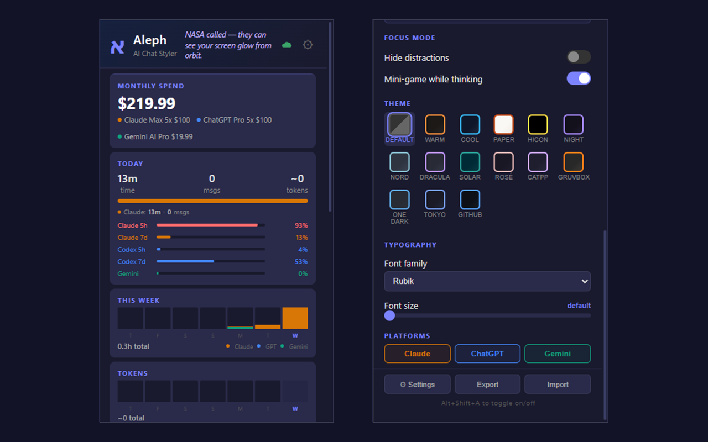
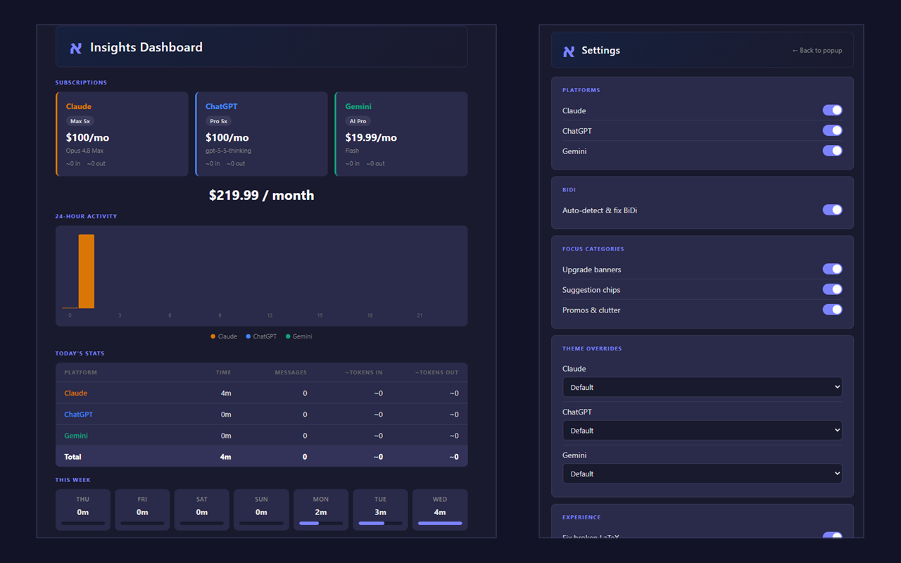
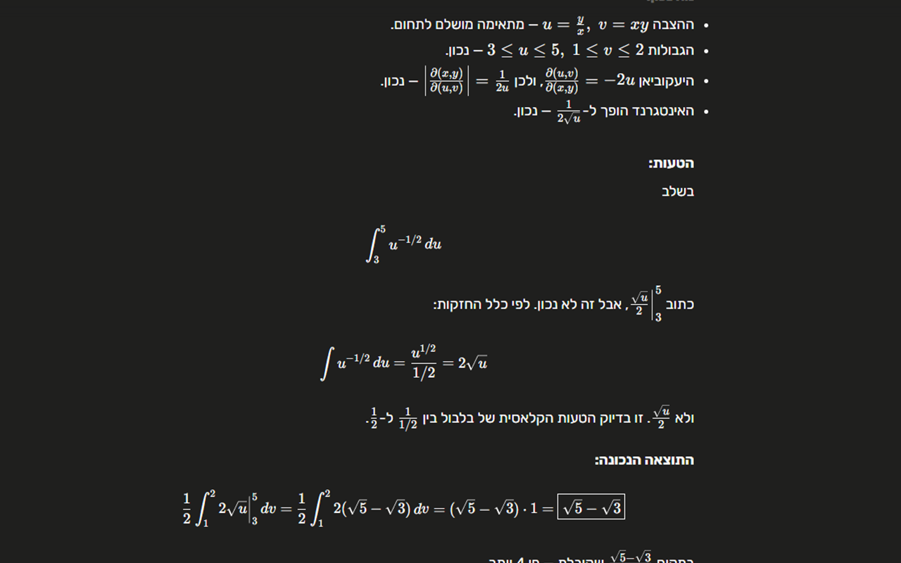

<p align="center">
  
</p>

<h1 align="center">Aleph - AI Chat Styler</h1>

Open-source Chrome extension that fixes Hebrew and Arabic-script text direction in Claude, ChatGPT, and Gemini, then gives the chats consistent themes, focus mode, typography, and usage insights.

[](https://chromewebstore.google.com/detail/jpicfbmjogpihahcmephbnibnjkfkfia)


[Install from the Chrome Web Store](https://chromewebstore.google.com/detail/jpicfbmjogpihahcmephbnibnjkfkfia) | [Website](https://offeck.github.io/aleph/) | [Privacy](PRIVACY.md) | [Sync design](docs/SYNC.md)


## Why Aleph exists

AI chat platforms still struggle with mixed-direction text. Hebrew, Arabic, Persian, or Urdu paragraphs can jump to the wrong side, punctuation can drift, lists can reorder, and math can collide with surrounding text.

Aleph fixes that at the element level. It detects Hebrew and Arabic-script letters from the actual page text, applies the right direction only where needed, and keeps math, code, and English passages readable.

## What it does

- Fixes Hebrew and Arabic-script BiDi rendering across Claude, ChatGPT, and Gemini
- Isolates KaTeX, MathJax, inline math, and code blocks so they stay left-to-right inside RTL text
- Works while responses stream in, using a bounded MutationObserver scan loop
- Adds 14 themes with optional per-platform overrides
- Supports custom text and code fonts, font size, line height, paragraph spacing, and chat width
- Hides upgrade banners, suggestion chips, promos, and clutter through focus mode
- Replaces default streaming effects with smoother animation options
- Shows local usage insights: time, sends, token estimates, subscriptions, and provider quota snapshots
- Keeps conversation text local and never sends telemetry

## Screenshots

| BiDi before and after | Popup controls |
| --- | --- |
|  |  |

| Insights and settings | RTL math |
| --- | --- |
|  |  |

## Install

### Chrome Web Store

Install the published extension from the [Chrome Web Store](https://chromewebstore.google.com/detail/jpicfbmjogpihahcmephbnibnjkfkfia).

### Local development build

1. Clone this repository.
2. Run `npm install`.
3. Run `npm run build`.
4. Open `chrome://extensions` in Chrome.
5. Enable **Developer mode**.
6. Click **Load unpacked** and select the repository root.

The repository root is the unpacked extension directory because `manifest.json` lives at the root.

## Supported platforms

| Platform | URL | BiDi fix | Styling | Usage insights |
| --- | --- | --- | --- | --- |
| Claude | `claude.ai` | Yes | Yes | Yes |
| ChatGPT | `chatgpt.com` / `chat.openai.com` | Yes | Yes | Yes |
| Gemini | `gemini.google.com` | Yes | Yes | Yes |

## How it works

The content script loads on supported AI chat sites and:

1. Detects the current platform from the hostname.
2. Uses platform-specific selector sets from `src/shared/selectors.ts`.
3. Observes page changes so streamed and newly inserted messages are scanned.
4. Marks elements containing Hebrew or Arabic-script letters with `data-aleph-rtl="true"`.
5. Applies CSS and dynamic settings for direction, typography, themes, spacing, and layout.

Math containers (`.katex`, `mjx-container`) and code blocks are intentionally isolated so they stay left-to-right even inside RTL messages.

## Privacy

Aleph is local-first:

- No telemetry
- No analytics
- No server reading conversation text
- Conversation text is not stored or synced

Settings are stored in Chrome storage. Optional Google sign-in can sync settings and aggregate daily usage summaries to your own cloud account. Those summaries are device-scoped, add across devices, and expire after 400 days. See [docs/SYNC.md](docs/SYNC.md) and [PRIVACY.md](PRIVACY.md) for details.

## Development

```bash
npm run build
npm run dev
npm run typecheck
npm run lint
npm test
npm run check
```

`npm run check` runs the merge gate used by CI: typecheck, lint, unit tests, and build.

Firestore rules tests are separate because they require the emulator and Java:

```bash
npm run test:rules
```

## Project structure

```text
aleph/
+-- manifest.json       # Chrome MV3 manifest; repo root is the unpacked extension
+-- src/
|   +-- content/        # BiDi engine, styles, focus mode, themes, streaming
|   +-- tracker/        # Usage tracking content script and platform adapters
|   +-- background/     # MV3 service worker, usage, sync, provider refresh
|   +-- popup/          # Popup controls and usage meters
|   +-- settings/       # Full settings page
|   +-- insights/       # Insights dashboard
|   +-- shared/         # Selectors, themes, defaults, messages, metrics, helpers
+-- docs/               # GitHub Pages site and project docs
+-- store-assets/final/ # Chrome Web Store screenshots
+-- tests/unit/         # Vitest unit coverage
+-- tests/rules/        # Firestore rules tests
+-- vendor/             # Vendored Firebase compat and KaTeX assets
+-- icons/
```

`dist/` is generated build output and is intentionally ignored. Edit `src/`, rebuild, reload the extension, then refresh the target AI chat page before verifying behavior.

## GitHub Pages

This repo includes a one-page website in `docs/index.html`. To publish it:

1. Open the repository settings on GitHub.
2. Go to **Pages**.
3. Set the source to the main branch and `/docs`.
4. Save.

The expected public URL is `https://offeck.github.io/aleph/`.

## Contributing

PRs are welcome. The most common maintenance work is updating selectors when Claude, ChatGPT, or Gemini change their DOM. Start with `src/shared/selectors.ts`, then check the tracker adapters in `src/tracker/platformAdapters/`.

Before opening a PR, run:

```bash
npm run check
```

## License

MIT
